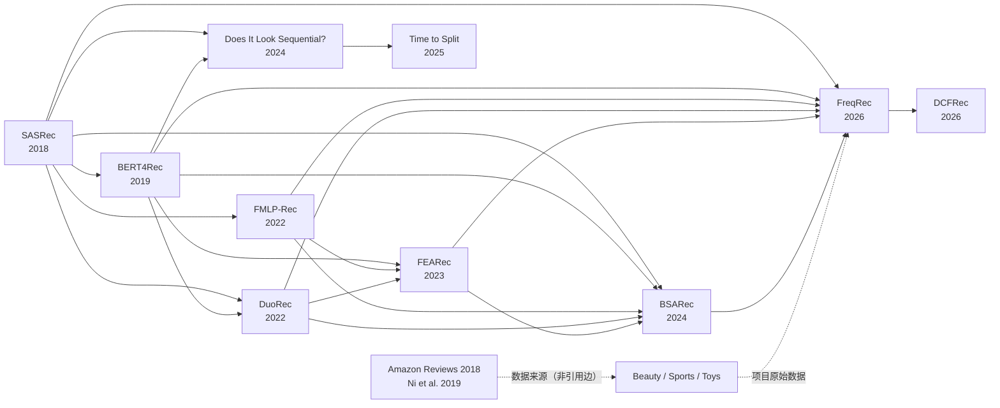

# 第五次课作业：FreqRec 候选论文筛选与双向引用追踪

> 检索与核验日期：2026-07-20
>
> 项目：`/Users/a1234/Code/Project/FreqRec科研`
>
> Zotero 状态：**已完成保存与核验**
>
> 保存分类：`推荐系统 / FreqRec`（保留已有 FreqRec 正式论文，新增其余 8 篇，共 9 个唯一题名）

## 作业要求

- 依据当前 FreqRec 项目涉及的研究方面筛选至少 5 篇、尽量不超过 10 篇候选论文；
- 对候选论文进行后向参考文献追踪和前向施引文献追踪，整理真实引用关系链；
- 导出 BibTeX，并核验论文是否真实、BibTeX 与正式出版信息是否一致；
- 在确认 Zotero 分类后，将论文保存到正确分类；
- 将最终结果整理为 Obsidian 作业笔记。

## 解题思路

以 FreqRec 正式论文为中心，从四个方向构造候选集：

1. **模型祖先与直接方法前身**：SASRec、BERT4Rec、FMLP-Rec、DuoRec、FEARec、BSARec；
2. **数据来源**：Amazon Reviews 2018 对应的 Ni et al. 2019；
3. **评测方法**：检查常用数据是否真正具有序列结构的 Does It Look Sequential?；
4. **项目执行范围**：优先保留 Baseline v1 正式比较模型，以及能够解释代码、数据文件和 corrected 协议的论文。

引用关系只在论文正文、参考文献或可靠文献索引明确记录时认定为“引用边”；数据血缘和项目方法关联单独标注，避免把主题相似误写成直接引用。

## 实现过程

### 项目范围与筛选依据

当前项目的正式 Baseline v1 聚焦三个 Amazon 类目 `Beauty`、`Sports_and_Outdoors`、`Toys_and_Games`，正式比较模型为 FreqRec、BSARec、FMLP-Rec、SASRec，并同时涉及以下研究方面：

1. 序列推荐中的自注意力建模；
2. 频域滤波、高低频信息恢复、频域 MLP；
3. 同目标序列增强与对比学习（项目含 `_same_target.npy`）；
4. Amazon Reviews 2018 数据来源与三个类目的数据血缘；
5. 训练/验证/测试切分、序列性和离线评测有效性。

据此保留 9 篇候选论文。GRU4Rec、Caser、DIFF 等虽在代码或 README 中出现，但为了将范围控制在十篇以内，且紧贴 Baseline v1 的正式模型、直接方法祖先、数据与评测问题，本次未列入最终候选集。

### 最终候选论文（9 篇）

| # | 论文 | 年份/场合 | 与项目的关系 | DOI |
|---|---|---|---|---|
| 1 | **Exploiting Inter-Session Information with Frequency-enhanced Dual-Path Networks for Sequential Recommendation**（FreqRec） | AAAI 2026 | 项目目标论文；跨会话/会话内双路径频域 MLP 与频域一致性损失 | [10.1609/aaai.v40i17.38502](https://doi.org/10.1609/aaai.v40i17.38502) |
| 2 | **An Attentive Inductive Bias for Sequential Recommendation beyond the Self-Attention**（BSARec） | AAAI 2024 | 项目正式基线；FreqRec 代码仓库明确基于 BSARec；融合高/低频与自注意力 | [10.1609/aaai.v38i8.28747](https://doi.org/10.1609/aaai.v38i8.28747) |
| 3 | **Frequency Enhanced Hybrid Attention Network for Sequential Recommendation**（FEARec） | SIGIR 2023 | 频域增强注意力、周期性建模、频域正则与对比学习；项目保留其模型实现 | [10.1145/3539618.3591689](https://doi.org/10.1145/3539618.3591689) |
| 4 | **Filter-enhanced MLP is All You Need for Sequential Recommendation**（FMLP-Rec） | WWW 2022 | 项目正式基线；三个数据文件的直接代码/预处理来源；可学习频域滤波器 | [10.1145/3485447.3512111](https://doi.org/10.1145/3485447.3512111) |
| 5 | **Contrastive Learning for Representation Degeneration Problem in Sequential Recommendation**（DuoRec） | WSDM 2022 | 解释项目 `_same_target.npy` 的同目标正样本增强与表示退化问题 | [10.1145/3488560.3498433](https://doi.org/10.1145/3488560.3498433) |
| 6 | **Self-Attentive Sequential Recommendation**（SASRec） | ICDM 2018 | 项目正式基线；后续 BERT4Rec、FMLP-Rec、DuoRec、FEARec、BSARec、FreqRec 的核心祖先 | [10.1109/ICDM.2018.00035](https://doi.org/10.1109/ICDM.2018.00035) |
| 7 | **BERT4Rec: Sequential Recommendation with Bidirectional Encoder Representations from Transformer** | CIKM 2019 | 双向序列编码和 Cloze 训练；项目含对应实现，也是多篇后续论文的比较基线 | [10.1145/3357384.3357895](https://doi.org/10.1145/3357384.3357895) |
| 8 | **Justifying Recommendations using Distantly-Labeled Reviews and Fine-Grained Aspects** | EMNLP-IJCNLP 2019 | Amazon Reviews 2018 数据发布所对应的引用论文；支撑 Beauty/Sports/Toys 数据血缘 | [10.18653/v1/D19-1018](https://doi.org/10.18653/v1/D19-1018) |
| 9 | **Does It Look Sequential? An Analysis of Datasets for Evaluation of Sequential Recommendations** | RecSys 2024 | 检查数据是否真的具有序列结构；直接支撑项目 corrected 协议和评测有效性讨论 | [10.1145/3640457.3688195](https://doi.org/10.1145/3640457.3688195) |

### 其他 8 篇与 FreqRec 原文的关系

| 论文 | 与 FreqRec 原文的具体关系 | 关系类型 | FreqRec 是否直接引用 |
|---|---|---|---|
| BSARec | FreqRec 最直接的模型前身和代码基础。BSARec 用 Fourier 高/低频融合缓解自注意力过平滑；FreqRec在此基础上加入跨会话与会话内双路径频域 MLP、频域一致性损失。 | 代码基础、直接方法前身、实验基线 | 是 |
| FEARec | 将频域自相关、混合注意力、对比学习和频域正则用于序列推荐，为 FreqRec“恢复高频和周期信息”的问题设定提供直接基础。 | 直接方法前身、实验基线 | 是 |
| FMLP-Rec | 以可学习频域滤波和全 MLP 处理序列；启发 FreqRec 的频域 MLP，同时其仓库是本项目 Beauty、Sports、Toys 数据文件的直接来源。 | 直接方法前身、正式基线、数据代码来源 | 是 |
| DuoRec | 通过 dropout 视图和“相同目标序列”构造对比正样本，解释项目 `_same_target.npy` 文件的用途；也是 FreqRec 的代表性对比学习基线。 | 直接引用基线、数据增强关联 | 是 |
| SASRec | FreqRec 自注意力分支的基础范式。FreqRec针对自注意力的低通/过平滑问题增加频域路径；SASRec也是 Baseline v1 正式基线。 | 架构祖先、正式基线 | 是 |
| BERT4Rec | 代表双向 Transformer 与 Cloze 训练分支，作为经典注意力序列推荐模型被 FreqRec用于相关工作和实验比较。 | 架构祖先、实验基线 | 是 |
| Ni et al. 2019 | 对应 Amazon Reviews 2018 数据发布，支撑 Beauty、Sports、Toys 三个类目的数据真实性和血缘；不是 FreqRec 的模型方法来源。 | 间接数据血缘 | 否 |
| Does It Look Sequential? | 分析常用推荐数据是否真的包含有效序列结构，支撑当前项目 corrected 协议对切分、泄漏和评测有效性的检查；不属于 FreqRec 原模型。 | 间接评测方法补充 | 否 |

结论：前 6 篇属于 FreqRec 原文直接引用的方法谱系；后 2 篇分别补足数据血缘与当前复现实验的评测方法。若只研究原模型，应优先阅读前 6 篇；若研究完整项目，则 8 篇都应保留。

### 双向引用追踪

#### 主要引用关系链

箭头方向为“被引用论文 → 引用它的后续论文”。实线表示已在论文正文/参考文献或 OpenAlex 引用关系中核验的引用边；数据来源关系单独以虚线表示，不混同为正式引用边。



#### 每篇论文的前向与后向追踪

| 论文 | 后向追踪：它引用/继承了什么 | 前向追踪：谁继续引用/扩展它 |
|---|---|---|
| FreqRec | 正文明确引用 SASRec、BERT4Rec、FMLP-Rec、DuoRec、FEARec、BSARec；同时沿用 Amazon 三类目实验设置 | OpenAlex 已索引 **DCFRec: Sequential recommendation via diffusion denoising and context-aware frequency-domain analysis**（2026，[DOI](https://doi.org/10.1016/j.ipm.2026.104752)）对其引用 |
| BSARec | 引用 SASRec、BERT4Rec、FMLP-Rec、DuoRec、FEARec，用 Fourier 高通归纳偏置缓解自注意力过平滑 | 被 FreqRec 直接引用并作为最强频域基线；后续也出现针对 BSARec/SASRec 的复现比较研究 |
| FEARec | 引用 BERT4Rec、FMLP-Rec、DuoRec等，结合频域自相关、混合注意力、对比学习和频域正则 | 被 BSARec 与 FreqRec 直接引用，形成“频域注意力 → 高频归纳偏置 → 跨会话双路径”的演化链 |
| FMLP-Rec | 以 SASRec 等神经序列推荐为比较对象，提出全 MLP 和可学习频域滤波 | 被 FEARec、BSARec、FreqRec 引用；其代码仓库还是本项目 Beauty/Sports/Toys 数据文件的直接来源 |
| DuoRec | 引用 SASRec、BERT4Rec等，针对表示各向异性/退化提出 dropout 视图与同目标正样本 | 被 FEARec、BSARec、FreqRec 引用；项目的 `_same_target.npy` 与该训练思想直接对应 |
| SASRec | 承接 Markov/RNN/CNN 序列推荐，首次以单向自注意力平衡长短期依赖 | 被 BERT4Rec、FMLP-Rec、DuoRec、BSARec、FreqRec 和评测论文广泛引用，是整条方法链的核心枢纽 |
| BERT4Rec | 引用 SASRec，改为双向 Transformer 和 Cloze 目标 | 被 DuoRec、FEARec、BSARec、FreqRec、评测论文引用，成为双向编码与遮蔽训练分支的核心节点 |
| Ni et al. 2019 | 建立在 Amazon review/recommendation 与可解释推荐工作上，发布/描述 Amazon Reviews 2018 数据 | 被大量后续推荐论文使用；本次核验到 **Text Is All You Need**（KDD 2023，[DOI](https://doi.org/10.1145/3580305.3599519)）直接引用该数据论文 |
| Does It Look Sequential? | 引用 SASRec、BERT4Rec及序列推荐评测文献，通过打乱交互顺序检验数据的真实序列性 | 被 **Time to Split: Exploring Data Splitting Strategies for Offline Evaluation of Sequential Recommenders**（RecSys 2025，[DOI](https://doi.org/10.1145/3705328.3748164)）直接引用 |

#### 关系链结论

1. **模型主链**：SASRec/BERT4Rec 提供注意力架构；FMLP-Rec 将滤波带入频域；DuoRec补充同目标对比增强；FEARec 将频域与混合注意力/频域正则结合；BSARec以高频归纳偏置缓解过平滑；FreqRec进一步引入跨会话与会话内双路径以及频域一致性损失。
2. **数据链**：Ni et al. 2019 对应 Amazon Reviews 2018；本项目三个原始类目文件经 FMLP-Rec/BSARec/FreqRec 代码链进入当前实验。该关系属于数据血缘，不等同于每篇模型论文都对 Ni et al. 建立了可索引的直接引用边。
3. **评测链**：SASRec/BERT4Rec 是被分析对象；Does It Look Sequential? 检验常用数据集是否真正有序列结构；Time to Split 继续研究切分策略。这与项目 corrected 协议对泄漏、切分和测试历史的控制高度一致。

### BibTeX 真实性与一致性核验

#### 核验方法

对每篇论文执行以下检查：

1. DOI 是否已注册并可解析到出版社/会议官方落地页；
2. Crossref DOI 记录与 OpenAlex 记录的规范化标题、年份、作者人数及作者集合是否一致；
3. DOI 内容协商导出的 BibTeX 是否包含正确的题名、作者、年份、场合、页码与 DOI；
4. 对项目 README 或 arXiv 中出现的元数据差异，优先采用正式出版版本。

#### 核验结果

| 论文 | DOI/正式页面 | Crossref ↔ OpenAlex | BibTeX 结论 |
|---|---|---|---|
| FreqRec | 通过，落地 AAAI 官方页面 | 标题、年份、7 位作者一致 | 真实文献；正式 AAAI 作者顺序与 Crossref 一致 |
| BSARec | 通过，落地 AAAI 官方页面 | 标题、年份、4 位作者一致 | 真实文献；AAAI OJS/Crossref 作为 proceedings journal 条目导出为 `@article` |
| FEARec | DOI 正确落地 ACM | 标题、年份、8 位作者一致 | 真实文献；ACM 元数据一致 |
| FMLP-Rec | DOI 正确落地 ACM | 标题、年份、4 位作者一致 | 真实文献；ACM 元数据一致 |
| DuoRec | DOI 正确落地 ACM | 标题、年份、4 位作者一致 | 真实文献；ACM 元数据一致 |
| SASRec | DOI 正确落地 IEEE Xplore | 标题、年份、2 位作者一致 | 真实文献；IEEE 元数据一致 |
| BERT4Rec | DOI 正确落地 ACM | 年份、7 位作者一致；Crossref/OpenAlex JSON 显示短题名 `BERT4Rec` | DOI BibTeX 与 ACM 正式页面给出完整题名，以下采用完整题名 |
| Ni et al. 2019 | 通过，落地 ACL Anthology | 标题、年份、3 位作者一致 | 真实文献；ACL/Crossref 元数据一致 |
| Does It Look Sequential? | DOI 正确落地 ACM | 标题、年份、4 位作者一致 | 真实文献；ACM 元数据一致 |

#### 发现的非实质性差异

- 项目 README 将 FreqRec 写成 `@inproceedings`，而 AAAI OJS/Crossref 导出为 `@article`，因为 AAAI Proceedings 以带 volume/issue 的 OJS 期刊式条目注册。标题、作者、年份和页码一致；以下采用正式 DOI 的 `@article`。
- FreqRec arXiv HTML 的作者展示顺序与 AAAI 正式版不一致。以下采用 AAAI 官方顺序：Peng He, Yanglei Gan, Tingting Dai, Run Lin, Xuexin Li, Yao Liu, Qiao Liu。
- Crossref/OpenAlex 的 BERT4Rec JSON 主显示字段只有短题名，但 DOI 内容协商 BibTeX和 ACM 页面包含完整副标题；以下保留完整正式题名。
- DOI 大小写、月份拼写和页码连接号属于格式差异。以下将 DOI 规范化，并将页码统一为 BibTeX 常用的双连字符。

### 核验后的 BibTeX

```bibtex
@article{he2026freqrec,
  title     = {Exploiting Inter-Session Information with Frequency-enhanced Dual-Path Networks for Sequential Recommendation},
  author    = {He, Peng and Gan, Yanglei and Dai, Tingting and Lin, Run and Li, Xuexin and Liu, Yao and Liu, Qiao},
  journal   = {Proceedings of the AAAI Conference on Artificial Intelligence},
  volume    = {40},
  number    = {17},
  pages     = {14820--14828},
  year      = {2026},
  publisher = {Association for the Advancement of Artificial Intelligence (AAAI)},
  doi       = {10.1609/aaai.v40i17.38502},
  url       = {https://doi.org/10.1609/aaai.v40i17.38502}
}

@article{shin2024bsarec,
  title     = {An Attentive Inductive Bias for Sequential Recommendation beyond the Self-Attention},
  author    = {Shin, Yehjin and Choi, Jeongwhan and Wi, Hyowon and Park, Noseong},
  journal   = {Proceedings of the AAAI Conference on Artificial Intelligence},
  volume    = {38},
  number    = {8},
  pages     = {8984--8992},
  year      = {2024},
  publisher = {Association for the Advancement of Artificial Intelligence (AAAI)},
  doi       = {10.1609/aaai.v38i8.28747},
  url       = {https://doi.org/10.1609/aaai.v38i8.28747}
}

@inproceedings{du2023fearec,
  title     = {Frequency Enhanced Hybrid Attention Network for Sequential Recommendation},
  author    = {Du, Xinyu and Yuan, Huanhuan and Zhao, Pengpeng and Qu, Jianfeng and Zhuang, Fuzhen and Liu, Guanfeng and Liu, Yanchi and Sheng, Victor S.},
  booktitle = {Proceedings of the 46th International ACM SIGIR Conference on Research and Development in Information Retrieval},
  series    = {SIGIR '23},
  pages     = {78--88},
  year      = {2023},
  publisher = {ACM},
  doi       = {10.1145/3539618.3591689},
  url       = {https://doi.org/10.1145/3539618.3591689}
}

@inproceedings{zhou2022fmlprec,
  title     = {Filter-enhanced {MLP} is All You Need for Sequential Recommendation},
  author    = {Zhou, Kun and Yu, Hui and Zhao, Wayne Xin and Wen, Ji-Rong},
  booktitle = {Proceedings of the ACM Web Conference 2022},
  series    = {WWW '22},
  pages     = {2388--2399},
  year      = {2022},
  publisher = {ACM},
  doi       = {10.1145/3485447.3512111},
  url       = {https://doi.org/10.1145/3485447.3512111}
}

@inproceedings{qiu2022duorec,
  title     = {Contrastive Learning for Representation Degeneration Problem in Sequential Recommendation},
  author    = {Qiu, Ruihong and Huang, Zi and Yin, Hongzhi and Wang, Zijian},
  booktitle = {Proceedings of the Fifteenth ACM International Conference on Web Search and Data Mining},
  series    = {WSDM '22},
  pages     = {813--823},
  year      = {2022},
  publisher = {ACM},
  doi       = {10.1145/3488560.3498433},
  url       = {https://doi.org/10.1145/3488560.3498433}
}

@inproceedings{kang2018sasrec,
  title     = {Self-Attentive Sequential Recommendation},
  author    = {Kang, Wang-Cheng and McAuley, Julian},
  booktitle = {2018 IEEE International Conference on Data Mining (ICDM)},
  pages     = {197--206},
  year      = {2018},
  publisher = {IEEE},
  doi       = {10.1109/ICDM.2018.00035},
  url       = {https://doi.org/10.1109/ICDM.2018.00035}
}

@inproceedings{sun2019bert4rec,
  title     = {{BERT4Rec}: Sequential Recommendation with Bidirectional Encoder Representations from Transformer},
  author    = {Sun, Fei and Liu, Jun and Wu, Jian and Pei, Changhua and Lin, Xiao and Ou, Wenwu and Jiang, Peng},
  booktitle = {Proceedings of the 28th ACM International Conference on Information and Knowledge Management},
  series    = {CIKM '19},
  pages     = {1441--1450},
  year      = {2019},
  publisher = {ACM},
  doi       = {10.1145/3357384.3357895},
  url       = {https://doi.org/10.1145/3357384.3357895}
}

@inproceedings{ni2019amazon,
  title     = {Justifying Recommendations using Distantly-Labeled Reviews and Fine-Grained Aspects},
  author    = {Ni, Jianmo and Li, Jiacheng and McAuley, Julian},
  booktitle = {Proceedings of the 2019 Conference on Empirical Methods in Natural Language Processing and the 9th International Joint Conference on Natural Language Processing (EMNLP-IJCNLP)},
  pages     = {188--197},
  year      = {2019},
  publisher = {Association for Computational Linguistics},
  doi       = {10.18653/v1/D19-1018},
  url       = {https://doi.org/10.18653/v1/D19-1018}
}

@inproceedings{klenitskiy2024sequential,
  title     = {Does It Look Sequential? An Analysis of Datasets for Evaluation of Sequential Recommendations},
  author    = {Klenitskiy, Anton and Volodkevich, Anna and Pembek, Anton and Vasilev, Alexey},
  booktitle = {18th ACM Conference on Recommender Systems},
  series    = {RecSys '24},
  pages     = {1067--1072},
  year      = {2024},
  publisher = {ACM},
  doi       = {10.1145/3640457.3688195},
  url       = {https://doi.org/10.1145/3640457.3688195}
}
```

## 结果与分析

### Zotero 保存结果与核验清单

当前 Zotero 分类树中存在：

- `推荐系统`
  - `FreqRec`

用户已确认保存到 `推荐系统 / FreqRec`。执行结果如下：

1. 保留原有 FreqRec 正式论文及 PDF，没有重复导入；
2. 其余 8 篇论文均已通过 DOI 导入该分类；
3. 分类内已核验到 9 个唯一题名，与候选清单逐一对应；
4. Zotero 导入后的题名、作者、年份、文献类型和 DOI 与前述核验结果一致；
5. Zotero 自动取得 5 篇 PDF，其余 4 篇保存了完整正式元数据、DOI 和出版社网址。

| Zotero 条目 | 保存结果 | PDF |
|---|---|---|
| FreqRec | 原有条目，保留且未重复 | 有 |
| BSARec | 新增成功 | 有 |
| FEARec | 新增成功 | 无自动附件 |
| FMLP-Rec | 新增成功 | 无自动附件 |
| DuoRec | 新增成功 | 有 |
| SASRec | 新增成功 | 无自动附件 |
| BERT4Rec | 新增成功 | 无自动附件 |
| Ni et al. 2019 / Amazon Reviews 2018 | 新增成功 | 有 |
| Does It Look Sequential? | 新增成功 | 有 |

最终核验：`推荐系统 / FreqRec` 中共 9 个候选论文条目，无重复题名。

### 综合分析

- **研究主线清晰**：SASRec/BERT4Rec 提供注意力基础，FMLP-Rec/FEARec/BSARec逐步引入频域建模，FreqRec进一步建模跨会话频域依赖并增加频域一致性损失。
- **候选集与项目一致**：四个 Baseline v1 正式模型全部覆盖；DuoRec 和 FEARec解释代码中的同目标增强与频域正则；数据论文和评测论文分别覆盖原始数据血缘及 corrected 协议。
- **元数据可信**：9 篇论文均有可解析 DOI，作者、年份和题名已由正式页面、Crossref、OpenAlex交叉核验。
- **保存结果完整**：Zotero 分类正确、无重复题名；未自动获取 PDF 的条目仍保留 DOI、正式页面和完整出版元数据。

## 复盘

- **做得好的地方**：候选论文不是仅按关键词选取，而是从代码、正式实验模型、数据来源和评测协议反向确定；引用边与数据关系分开标注；BibTeX 使用正式出版版本。
- **需要改进的地方**：OpenAlex 对刚发表的 FreqRec 尚未完整索引参考文献，部分引用边仍需结合论文正文核验；ACM/IEEE 的付费或访问限制导致部分 PDF 未由 Zotero 自动取得。
- **后续补充**：可继续阅读 DCFRec、Time to Split 等前向引用论文，进一步形成“频域模型创新”和“公平评测协议”两条选题线。

### 主要核验来源

- [FreqRec — AAAI 官方页面](https://ojs.aaai.org/index.php/AAAI/article/view/38502)
- [BSARec — AAAI 官方页面](https://ojs.aaai.org/index.php/AAAI/article/view/28747)
- [FEARec — ACM DOI](https://doi.org/10.1145/3539618.3591689)
- [FMLP-Rec — ACM DOI](https://doi.org/10.1145/3485447.3512111)
- [DuoRec — ACM DOI](https://doi.org/10.1145/3488560.3498433)
- [SASRec — IEEE DOI](https://doi.org/10.1109/ICDM.2018.00035)
- [BERT4Rec — ACM DOI](https://doi.org/10.1145/3357384.3357895)
- [Amazon Reviews 2018 / Ni et al. — ACL Anthology](https://aclanthology.org/D19-1018/)
- [Does It Look Sequential? — ACM DOI](https://doi.org/10.1145/3640457.3688195)
- Crossref：DOI 注册元数据与 BibTeX 内容协商
- OpenAlex：引用关系、前向引用与元数据交叉检查
